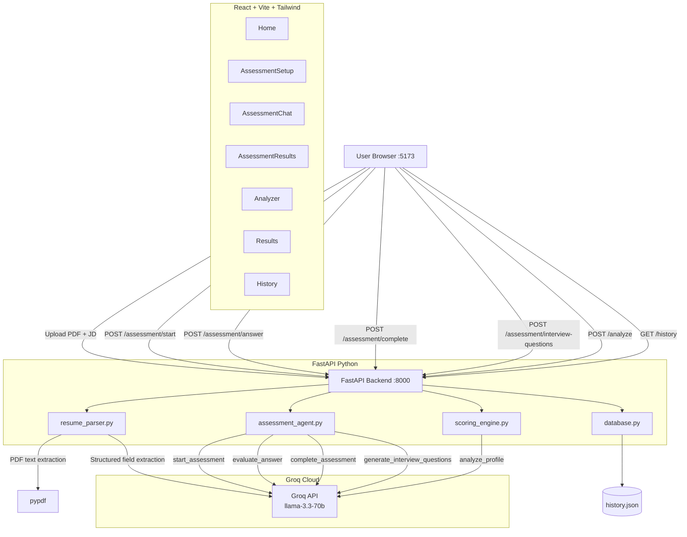

# Architecture

## System Diagram



---

## Assessment Agent Flow

```
1. POST /assessment/start
   ├── resume_parser.py extracts raw text from PDF
   ├── Groq identifies top 6 skills from JD to assess
   └── Returns: session_id, first question, skills overview

2. POST /assessment/answer  (called once per question)
   ├── Groq evaluates the candidate's answer (0-100 score)
   ├── Assigns proficiency level: expert/proficient/familiar/beginner/no_knowledge
   ├── Generates transition message + next question
   └── Returns: score, reasoning, next question (or completed=true)

3. POST /assessment/complete
   ├── Groq generates full personalised report:
   │   ├── overall_proficiency_score
   │   ├── skill_gap_analysis (current vs required, priority)
   │   ├── adjacent_skills (realistically acquirable given background)
   │   ├── learning_plan (week-by-week, with resource links + time estimates)
   │   ├── top_3_priorities
   │   └── interview_readiness
   └── Saves full report to history.json

4. POST /assessment/interview-questions
   ├── Groq generates questions per weak skill (score < 75)
   ├── Includes: difficulty, what_interviewer_tests, answer_hint, follow_up
   ├── Also generates strong-skill challenges + behavioral questions
   └── Returns: weak_skill_questions, strong_skill_questions, behavioral_questions, tips
```

---

## Component Breakdown

### Frontend Pages

| Page | Route | Purpose |
|------|-------|---------|
| Home | `/` | Landing page, feature overview |
| AssessmentSetup | `/assessment` | Upload resume PDF + paste JD |
| AssessmentChat | `/assessment/chat` | Conversational interview UI |
| AssessmentResults | `/assessment/results` | Full report, learning plan, interview questions |
| Analyzer | `/analyze` | Resume analyzer with sample data |
| Results | `/results` | Resume analysis results |
| History | `/history` | All past assessments + analyses |

### Backend Modules

| File | Responsibility |
|------|---------------|
| `main.py` | FastAPI app, CORS, all route handlers, session management |
| `assessment_agent.py` | All 4 Groq AI calls: start, evaluate, complete, interview questions |
| `scoring_engine.py` | Groq AI resume scoring with rule-based fallback |
| `resume_parser.py` | Groq AI PDF parsing with rule-based fallback |
| `models.py` | Pydantic request/response models |
| `database.py` | JSON file persistence |

### Session Management

Assessment sessions are stored in-memory in `SESSIONS` dict in `main.py`:
- Keyed by `session_id` (UUID) during active assessment
- Keyed by `report_{session_id}` after completion (for interview questions)
- Full report saved to `history.json` on completion

### AI Fallback Strategy

Every AI call has a rule-based fallback:
```
Groq API available?
  ├── YES → Use llama-3.3-70b-versatile
  └── NO  → Fall back to rule-based engine
```

This ensures the app works even without an API key (for demos/testing).

### Storage

- `history.json` auto-created on first use
- Assessment records: full report including skill_scores, learning_plan, adjacent_skills
- Resume records: scores, strengths, weaknesses, roadmap
- Both types displayed separately in History page
